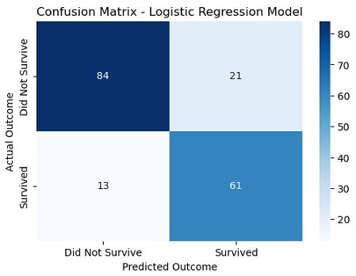

# Titanic-Capstone-Project

Python AI / ML student project. Capstone project built on machine learning system based on real-world data and deployed as a Django web application.


## Contents
1. [Project Overview](#porject-overview)
2. [How to set up files and run locally](#how-to-set-up-the-file-and-run-locally)
3. [Description of the ML model](#description-of-the-machine-learning-models)
4. [Overview of the system architecture](#overview-of-the-system-architecture)

## Project Overview 
The Titanic++ Capstone Project is an end-to-end machine learning and web development project that demonstrates how a predictive model can be built from raw data and deployed as a real-world application.
Using historical passenger data from the Titanic disaster, this project builds a machine learning model to predict whether a passenger survived based on demographic and travel-related features such as age, gender, passenger class, and family size. The trained model is integrated into a Django-based web application where users can input passenger details and receive survival predictions along with probability scores.
The system also persists prediction inputs and results in a database, allowing users to view prediction history. The project follows software engineering best practices including modular design, version control with Git, and clear documentation.
This project simulates a realistic production-style workflow that combines data science, machine learning, backend web development, and deployment principles.


The purpose of this project is to gain hands-on experience in building and deploying a complete machine learning system rather than focusing only on model accuracy.
Specifically, this project aims to:

- Develop a strong understanding of data preprocessing, feature engineering, and model evaluation
- Practice building reproducible machine learning pipelines
- Learn how to deploy a trained ML model inside a Django web application
- Understand how machine learning systems interact with databases and user interfaces
- Apply software engineering best practices, including modular design and separation of concerns
- Improve proficiency with Git and GitHub through continuous, meaningful commits
- Simulate a real-world ML product lifecycle, from raw data to user-facing application
  Overall, the project bridges the gap between theoretical machine learning and practical software development by delivering a fully functional prediction system that mirrors how ML-powered applications are built in industry.

Go back to [Contents](#contents).

## How to set up the file and run locally
Download the Titanic dataset at [Titanic]( https://www.kaggle.com/c/titanic/data)

Go back to [Contents](#contents).
## Description of the machine learning models

 


Go back to [Contents](#contents).
## Overview of the System Architecture

### 1. Data Preprocessing
#### 1️⃣ Handling Missing Values
#### Age
Instead of using a global average, missing **Age** values were imputed using **title-based grouping**:

- **Title Extraction:** Extracted from the `Name` column.

  Example:
  - `"Braund, Mr. Owen Harris" → Mr`
  - `"Cumings, Mrs. John Bradley" → Mrs`
- **Title Grouping:** 
  
  A new feature called **Title** by extracting it from **Name** column and grouping titles into **Mr, Mrs, Miss, Master** and **Rare** categories. Missing **Age** values(NaN) are then replaced with the mean age within each title group.

- **Age Imputation:** 
  
  Missing `Age` values were filled with the **mean age** of the corresponding title group.  

#### Embarked
This feature contains only two missing values, which are unlikely to affect the model's performance. Therefore, these values are imputed with **C**

#### 2️⃣ Encoding Categorical Variables
  - **Sex:**
    - `male → 0`
    - `female → 1`
  - **Embarked(C/Q/S):**
    - `Embarked_C`
    - `Embarked_Q`
    - `Embarked_S`
    - One-hot encoding was used to prevent the model from assuming any ordinal relationship between embarkation ports.
  - **Title:**
    - Grouping titles into **Mr, Mrs, Miss, Master** and **Rare**.
    - Titles extracted from `Name` were also encoded:
      ```text
      Mr → 0  
      Mrs → 1  
      Miss → 2  
      Master → 3  
      Rare → 4
    - This allows the model to learn the survival patterns realated to social status and age groups.

#### 3️⃣ Feature Engineering 
- **FamilySize:**
  A new feature called `FamilySize` is created by adding `SibSp + Parch +1`. This represents the **total number of family members aboard**, including the passenger themselves.

- **CabinDeck:**
  `CabinDeck` is extracted from cabin numbers, yielding values `['Unknown', 'C', 'E', 'G', 'D', 'A', 'B', 'F', 'T']`. Survival was significantly lower for passengers with `Unknown` deck, while decks `B`, `D`, and `E` showed the highest survival rates.

- **Age Bin:** 
  The age feature is grouped into categorical age ranges to reduce noise and capture life-stage patterns that may influence survival. The bins are defined as:
  
  - **Child:** 0-12 years
  - **Teen:** 13-19 years
  - **Adult:** 20-39 years
  - **Middle Aged:** 40-59 years
  - **Senior:** 60+ years

### 2. Model Training
- **Model Selection**
  - **Baseline Model: Logistic Regression**  
    We start with logistic regression as a baseline because survival is a binary outcome (`0`/`1`). It is a simple model that provides a strong reference point for comparing more complex models.
  - **Candidate Model 1: Random Forest**  
    *TODO: Why it may improve on baseline (e.g., nonlinearity, interactions).*
  - **Candidate Model 2: XGBoost**  
    *TODO*

- **Validation Strategy**  
  We split data with `test_size=0.1` (90% train / 10% test). *TODO: Model tuning is performed with cross-validation on the training set only. The test set is used once for final evaluation.*

- **Evaluation Metrics**  

  The Titanic Dataset is slightly imbalanced as shown below:

  | Class               | Count | Percentage |
  | ------------------- | ----- | ---------- |
  | 0 (Not survived) | 549   | ~62%       |
  | 1 (Survived)        | 342   | ~38%       |
  
  With 62% non-survivors (Majority Class) and 38% survivors (Minority Class). The accuracy is biased towards to non-survivors, therefore we focus on `f1` for the survivors (minority class). 
  And Use `stratify=y` in `train_test_split` so that so that **the class distribution in train and test sets matches the original distribution of y**.
  - **Logistic Model Overall Performance**
  
    Mean F1-score = 0.7566
    | Class                   | Precision | Recall | F1-Score | Support |
    | ----------------------- | --------- | ------ | -------- | ------- |
    | **0 – Not Survive** | ✔0.87      | ✔0.80   | ✔0.83     | 105     |
    | **1 – Survived**        | •0.74      | ✔0.82   | •**0.78**     | 74      |
    | **Accuracy**            |           |        | ✔**0.81** | 179     |
    | **Macro Avg**           | 0.80      | 0.81   | 0.81     | 179     |
    | **Weighted Avg**        | 0.82      | 0.81   | 0.81     | 179     |

  - **Random Forest** 

  - **Confusion Matrix**  
  The model performs well at distinguishing between survivors and non-survivors, correctly identifying most passengers. It occasionally overestimates survival, but overall the confusion matrix shows that the model makes relatively few misclassifications and captures the patterns in the data effectively.

     

### 3. Django Integration
- Explain how the model is loaded  
- Show form design and validation  
- Explain preprocessing applied to user input  
- Describe how predictions are displayed 

Go back to [Contents](#contents).
